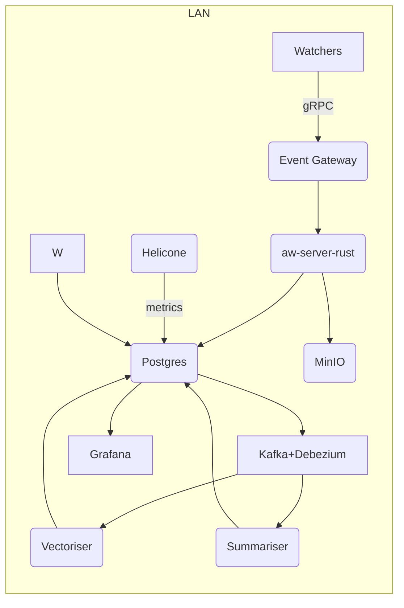
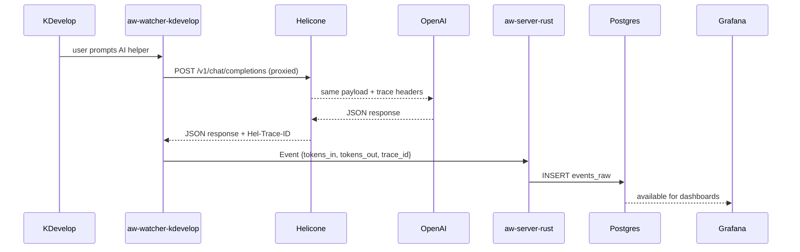

## **JSON Schema Overview of iVibe Funtionality**

```
{
  "ProjectName": "iVibe.live",
  "Version": "2.0",
  "Domain": "iVibe.live",
  "CorePhilosophy": "Redefine social media through genuine human connection: replace algorithmic feeds and superficial likes with proximity‑based growth, user‑controlled privacy, and association over judgment. The platform combats loneliness by turning everyday encounters into meaningful relationships, emphasising positive reinforcement, anti‑bullying architecture, and holistic well‑being.",
  "Overview": "iVibe.live is an advanced multi‑modal activity intelligence and social connection platform that captures developer activity, emotional states, AI usage, and location context across all devices. The system stores and analyses this data through a unified self‑hosted dashboard, powered by Grafana, and surfaces actionable insights. It is local‑first and privacy‑respecting by design, with optional remote LLM usage via Helicone and OpenAI. The new implementation leverages Rust and TypeScript for maximal performance, safety, and cross‑platform reach.",
  "ProgrammingLanguages": {
    "Core": "Rust",
    "Frontend": "TypeScript",
    "Mobile": "Kotlin (Android) with future Swift (iOS)",
    "Bridge": "WebAssembly and N‑API for Rust⇆TypeScript interoperability",
    "Database": "SQL (PostgreSQL with TimescaleDB and pgvector)"
  },
  "SupplyChainRiskMitigation": {
    "Rust": {
      "UseCargoAudit": true,
      "UseCargoDeny": true,
      "VendorDependencies": true,
      "CommitLockfile": true,
      "CICommands": ["cargo audit", "cargo deny"],
      "BuildFlags": ["--locked"],
      "SignArtifacts": true
    },
    "TypeScript": {
      "CommitLockFile": true,
      "AuditInCI": "npm audit --production",
      "EnableProvenance": true,
      "UseVersionResolutions": true,
      "UsePnpm": true,
      "PinNode": true
    },
    "Common": {
      "EnforceTwoFactorAuth": true,
      "UseDependabotOrSnyk": true,
      "SignReleases": true,
      "AvoidInstallScripts": true
    }
  },
  "Architecture": {
    "Planes": {
      "CapturePlane": "Local agents capture events from desktop, terminal, browser, mobile devices, audio streams, and emotion detection cameras. Each watcher sends structured events to the transport plane.",
      "TransportPlane": "A gRPC/HTTP2 event gateway written in Rust authenticates clients with Keycloak, attaches tenant identifiers, and relays event batches over TLS to the processing plane.",
      "ProcessingPlane": "Rust services ingest events into Postgres, vectorise text and audio using OpenAI embeddings or local models, summarise daily activity via OpenAI API, and roll up statistics via ETL. A scheduler orchestrates hourly and daily jobs.",
      "PresentationPlane": "Rust APIs expose REST/GraphQL endpoints. A TypeScript/React frontend and React Native mobile app render dashboards and reports. Grafana dashboards query TimescaleDB directly for real‑time charts. Public profiles are served with privacy filters. Stripe billing portal manages subscriptions."
    },
    "Modules": [
      {
        "Name": "aw‑watcher‑window",
        "Language": "Rust",
        "Purpose": "Capture window focus events and active file paths on desktops across Linux, Windows and macOS. Listen to DBus/XDG events on Linux and equivalent APIs on other platforms.",
        "KeyTasks": [
          "Fork ActivityWatch window watcher",
          "Integrate with KDevelop via DBus and the KTextEditor plugin API",
          "Emit events containing application name, window title, file path, branch, and programming language",
          "Batch events and send via gRPC"
        ]
      },
      {
        "Name": "aw‑watcher‑kdevelop",
        "Language": "Rust",
        "Purpose": "A KTextEditor plugin that emits editor events such as file open, save, compile, debug sessions, code completion, and error occurrences.",
        "KeyTasks": [
          "Monitor KDevelop API calls",
          "Attach metadata (project name, branch, line number, language)",
          "Detect compilation status and debug sessions",
          "Stream events to the gateway"
        ]
      },
      {
        "Name": "aw‑watcher‑browser",
        "Language": "TypeScript (Manifest V3 extension)",
        "Purpose": "Capture URL, tab focus time, scroll depth, form interactions, research versus casual browsing classification, and AI chat usage (ChatGPT, Claude, etc.).",
        "KeyTasks": [
          "Build Chrome/Firefox/Edge/Brave/Safari extension using TypeScript",
          "Track active tab and duration",
          "Categorise domains (development, research, entertainment)",
          "Detect research patterns based on user input and keywords",
          "Detect AI chat usage and record provider and token usage",
          "Send events to the gateway"
        ]
      },
      {
        "Name": "aw‑watcher‑terminal",
        "Language": "Rust",
        "Purpose": "Monitor shell sessions (Bash, Zsh, Fish, PowerShell) and record commands, execution durations, exit codes, and errors. Tag errors as fixed or unresolved.",
        "KeyTasks": [
          "Intercept commands via shell wrappers or pseudo‑terminal integration",
          "Record stderr and classify errors",
          "Mark subsequent successful runs as fixes",
          "Send event batches via gRPC"
        ]
      },
      {
        "Name": "aw‑watcher‑mobile",
        "Language": "Kotlin (Android) with Rust FFI",
        "Purpose": "Track app usage, location context, microphone hot‑word triggers, phone state, inter‑app data sharing, communication patterns (metadata only), battery and network usage, and emotion detection via camera on Android.",
        "KeyTasks": [
          "Implement background service capturing foreground app and usage stats",
          "Integrate location services to detect restaurants, offices, shops, travel",
          "Vectorise audio via on‑device embedding model and discard raw audio",
          "Track call and text logs metadata (number of calls, duration) without storing content",
          "Detect facial expressions via camera and classify into emotions with context capture (active app, screenshot, location, timestamp)",
          "Transmit vectorised events to the gateway securely"
        ]
      },
      {
        "Name": "aw‑watcher‑audio",
        "Language": "Rust",
        "Purpose": "Capture ambient audio segments triggered by hot‑word or context, convert them into high‑dimensional vectors using privacy‑preserving embeddings, and store only embeddings for analysis and marketing insights.",
        "KeyTasks": [
          "Detect hot‑words or noise threshold using on‑device models",
          "Record short audio snippets and convert to embeddings",
          "Discard raw audio after conversion",
          "Attach contextual metadata (location, timestamp)",
          "Send embeddings to processing plane"
        ]
      },
      {
        "Name": "EmotionDetectionService",
        "Language": "Rust + WASM for inference",
        "Purpose": "Analyse camera frames from phones, laptops, or desktops to classify emotions (smile, laugh, cry, fear, anger) and record the trigger context such as current screen, active application, location and nearby Vibers.",
        "KeyTasks": [
          "Integrate with device cameras via platform‑specific APIs",
          "Run facial detection and emotion classification models compiled to WASM",
          "Capture screenshots or context snapshots of the screen",
          "Record active app/window and URL",
          "Detect nearby Vibers via Bluetooth or Wi‑Fi",
          "Associate emotion events with triggers and store embeddings"
        ]
      },
      {
        "Name": "VibeSocialEngine",
        "Language": "Rust (core) + TypeScript (UI)",
        "Purpose": "Implement the social interaction model: detect proximate Vibers (vibe‑bys), compute compatibility scores (1–1000), manage friend requests, maintain My Vibers list, and share Viber links.",
        "KeyTasks": [
          "Scan for nearby devices via Bluetooth LE and Wi‑Fi and broadcast encrypted identifiers",
          "Calculate Vibe Score based on shared emotions, interests, activities, and places",
          "Allow users to send and accept vibe requests",
          "Manage My Vibers list with privacy settings",
          "Enable sharing of Viber links with scope limitations",
          "Delete data when requests are denied or blocks occur",
          "Sync Vibe data only when Vibers are nearby"
        ]
      },
      {
        "Name": "EventGateway",
        "Language": "Rust (Actix or tonic gRPC)",
        "Purpose": "Serve as the secure entry point for all capture clients. Authenticate via Keycloak, validate JWTs, attach tenant context, and forward events to processing services over gRPC or NATS. Support both unary and streaming calls.",
        "KeyTasks": [
          "Terminate TLS connections and verify client certificates",
          "Validate OAuth2 tokens and extract claims via Keycloak",
          "Attach tenant_id header for row‑level security in Postgres",
          "Forward EventBatch messages to aw‑server‑rust",
          "Enforce request size limits and back‑pressure"
        ]
      },
      {
        "Name": "aw‑server‑rust",
        "Language": "Rust",
        "Purpose": "Ingest raw capture events into the `events_raw` table in Postgres. Partition data by month and hash user IDs to allow efficient queries. Persist metadata about audio objects in MinIO.",
        "KeyTasks": [
          "Accept EventBatch messages via gRPC",
          "Validate event schema and apply tenant row‑level policies",
          "Insert JSON events into TimescaleDB hypertables",
          "Store audio object references in MinIO with only hash and metadata stored in Postgres",
          "Push changes into Kafka via Debezium logical replication"
        ]
      },
      {
        "Name": "VectoriserService",
        "Language": "Rust",
        "Purpose": "Consume events from Kafka and convert textual payloads (URLs, prompts, messages) and audio embeddings into high‑dimensional embeddings stored in the `embeddings` table.",
        "KeyTasks": [
          "Consume `events_raw` topic from Kafka",
          "Extract textual fields and convert to embeddings using OpenAI `text-embedding-3-small` API via Helicone; fallback to local model",
          "Store embeddings with primary keys into pgvector column in Postgres",
          "Log provider and token usage for cost accounting"
        ]
      },
      {
        "Name": "SummariserJob",
        "Language": "Rust (with asynchronous tasks)",
        "Purpose": "Generate daily summaries and digests of user activities per project or context using OpenAI Chat Completions API. Summaries are stored in the `summaries` table with associated embeddings for semantic search.",
        "KeyTasks": [
          "Fetch last 24h events per project from Postgres",
          "Send content to OpenAI Chat Completions API (GPT‑4o) via Helicone, retrieving structured summaries and cost details",
          "Store summarised markdown and embeddings in Postgres",
          "Run summarization using OpenAI GPT-4o for all users",
          "Schedule via Cron (04:00 UTC)"
        ]
      },
      {
        "Name": "ETLOrchestrator",
        "Language": "Rust",
        "Purpose": "Aggregate raw events into materialised views and roll‑ups for Grafana dashboards. Generate compliance exports.",
        "KeyTasks": [
          "Create materialised views such as `mv_time_by_language`, `mv_errors_fixed`, `mv_token_usage`, `mv_emotions`, `mv_vibe_scores`",
          "Refresh views hourly or daily depending on use‑case",
          "Maintain unlimited data retention for all users",
          "Generate exports (CSV, JSON, PDF) and invoices from time data",
          "Generate exports (CSV, JSON, PDF) for users"
        ]
      },
      {
        "Name": "PublicProfileAPI",
        "Language": "Rust",
        "Purpose": "Serve user‑controlled public dashboards at `/u/{handle}` with privacy filters. Render HTML via templates and expose JSON endpoints for third‑party integrations.",
        "KeyTasks": [
          "Fetch summaries and metrics for the user while respecting privacy flags",
          "Apply bitmasks to remove private fields before rendering",
          "Allow users to share selective data publicly",
          "Cache responses for performance"
        ]
      },
      {
        "Name": "DonationHandler",
        "Language": "Rust (Actix Web)",
        "Purpose": "Process community donations and funding events. Handle donor acknowledgments and community support features.",
        "KeyTasks": [
          "Verify donation signatures",
          "Process donation events and acknowledgments",
          "Update community supporter status",
          "Handle donation portal access for community funding",
          "Manage community contribution tracking"
        ]
      },
      {
        "Name": "IdentityProvider",
        "Language": "Rust wrapper around Keycloak",
        "Purpose": "Manage user authentication, single sign‑on, and token issuance. Provide OAuth2 scopes for capture clients and restrict API routes based on roles.",
        "KeyTasks": [
          "Deploy Keycloak configured with SSO clients for web, mobile, and CLI",
          "Issue OIDC JWTs for capture clients",
          "Rotate signing keys and enforce mutual TLS inside the LAN",
          "Integrate with Stripe Customer Portal for SSO",
          "Support social logins in future versions"
        ]
      }
    ],
    "EventSchema": {
      "event_id": "uuid4",
      "user_id": "uuid4",
      "timestamp": "RFC3339",
      "source": "One of ['terminal','browser','kdevelop','mobile','audio','emotion','vibe']",
      "project": "string",
      "language": "programming language where applicable",
      "payload": "source‑specific fields such as window title, URL, commands, emotion scores, location, embeddings, etc."
    }
  },
  "Features": [
    {
      "Name": "Comprehensive Activity Tracking",
      "Description": "Track time spent in each application, detect files and projects, record programming branches and languages, and monitor idle time. Works across desktop, terminal, browser and mobile environments.",
      "Implementation": {
        "Desktop": "aw‑watcher‑window and aw‑watcher‑kdevelop (Rust)",
        "Terminal": "aw‑watcher‑terminal (Rust)",
        "Browser": "aw‑watcher‑browser (TypeScript)",
        "Mobile": "aw‑watcher‑mobile (Kotlin)"
      },
      "Availability": {
        "Free": true,
        "Essential": true,
        "Elite": true,
        "Team": true,
        "Business": true
      }
    },
    {
      "Name": "Terminal Intelligence",
      "Description": "Capture every command executed along with durations, exit codes, and error classifications. Distinguish between fixed and unresolved errors and compute success rates.",
      "Implementation": {
        "Terminal": "aw‑watcher‑terminal monitors shells and tags errors via pattern matching."
      },
      "Availability": {
        "Free": true,
        "Essential": true,
        "Elite": true,
        "Team": true,
        "Business": true
      }
    },
    {
      "Name": "Browser Monitoring",
      "Description": "Record complete browsing history, tab focus durations, scroll depth, research versus casual browsing classification, AI chat usage detection, and productivity scoring.",
      "Implementation": {
        "BrowserExtension": "TypeScript extension using Manifest V3; streams events via local WebSocket"
      },
      "Availability": {
        "Free": true,
        "Essential": true,
        "Elite": true,
        "Team": true,
        "Business": true
      }
    },
    {
      "Name": "Mobile Tracking Suite",
      "Description": "On Android, collect app usage statistics, detect places, vectorise audio context, record call and SMS metadata, monitor battery and network usage, and detect facial emotions with context capture.",
      "Implementation": {
        "Mobile": "Kotlin service with Rust FFI for emotion detection and audio embeddings"
      },
      "Availability": {
        "Free": false,
        "Essential": false,
        "Elite": true,
        "Team": true,
        "Business": true
      }
    },
    {
      "Name": "Emotion Analytics",
      "Description": "Real‑time facial recognition classifies emotions (smile, laugh, cry, fear, anger) across devices. Captures triggers via screenshots, active apps, URLs, nearby vibers, location and timestamps. Provides mood patterns and triggers analysis.",
      "Implementation": {
        "Desktop": "Rust + WASM model for webcam analysis",
        "Mobile": "Kotlin with embedded model",
        "Backend": "Embeddings stored in Postgres, analytics via Grafana"
      },
      "Availability": {
        "Free": false,
        "Essential": false,
        "Elite": true,
        "Team": true,
        "Business": true
      }
    },
    {
      "Name": "Vibe Social System",
      "Description": "Facilitate proximity‑based social connections. Automatically detect nearby iVibe users (vibers), calculate compatibility scores (1–1000) based on emotions, interests, activities and places, allow sending and accepting vibe requests, manage My Vibers list, share Viber links, and block or deny requests with all data deleted.",
      "Implementation": {
        "Core": "Rust engine calculates scores and manages state",
        "UI": "TypeScript React components for vibe interactions"
      },
      "Availability": {
        "Free": true,
        "Essential": true,
        "Elite": true,
        "Team": true,
        "Business": true
      }
    },
    {
      "Name": "AI Integration and Token Tracking",
      "Description": "Monitor AI usage across providers (OpenAI, Anthropic, Google, local models). Record input/output tokens, costs, prompt patterns, and attribute usage to projects. Suggest cost optimisations and track success rates.",
      "Implementation": {
        "Proxy": "Helicone proxy observes calls and attaches project_id and user_id",
        "Backend": "Rust inserts token events into Postgres; summariser uses OpenAI for digests"
      },
      "Availability": {
        "Free": false,
        "Essential": true,
        "Elite": true,
        "Team": true,
        "Business": true
      }
    },
    {
      "Name": "Location Intelligence",
      "Description": "Automatically detect places (restaurants, offices, stores, homes) via GPS and Wi‑Fi. Provide detailed context such as actions performed (ordering tacos, working remotely). Enable geofencing to mute tracking within certain radii.",
      "Implementation": {
        "Mobile": "Kotlin service performs geofencing and reverse geocoding"
      },
      "Availability": {
        "Free": false,
        "Essential": false,
        "Elite": true,
        "Team": true,
        "Business": true
      }
    },
    {
      "Name": "Advanced Analytics",
      "Description": "Provide Grafana dashboards for real‑time metrics and historical trends, rendered as high‑quality professional‑grade charts and graphs. Dashboards include coding time by language, errors fixed versus introduced, AI tokens per day, emotion patterns, vibe score distributions, and social engagement metrics. Support custom dashboards and team/organization views.",
      "Implementation": {
        "Grafana": "Charts configured to query TimescaleDB materialised views via Grafana data sources",
        "Export": "Enable exporting dashboards as CSV, JSON, PDF and SVG"
      },
      "Availability": {
        "Free": true,
        "Essential": true,
        "Elite": true,
        "Team": true,
        "Business": true
      }
    },
    {
      "Name": "Reporting and Exports",
      "Description": "Generate daily, weekly, and monthly email reports summarising activity. Offer export options (CSV, JSON, PDF, SVG) for self‑service analytics, invoices and legal evidence packages. Provide API access for programmatic retrieval.",
      "Implementation": {
        "Backend": "ETL orchestrator produces exports; REST API serves files",
        "Mail": "SMTP service sends reports with attachments"
      },
      "Availability": {
        "Free": {"EmailReports": ["Weekly"], "Exports": false},
        "Essential": {"EmailReports": ["Daily","Weekly"], "Exports": false},
        "Elite": {"EmailReports": ["Daily","Weekly","Monthly"], "Exports": true},
        "Team": {"EmailReports": ["Daily","Weekly","Monthly"], "Exports": true},
        "Business": {"EmailReports": ["Daily","Weekly","Monthly"], "Exports": true}
      }
    },
    {
      "Name": "Integrations Marketplace",
      "Description": "Support over 100 IDE and editor plugins, plus external services integrations such as Bitbucket, GitHub, GitLab, Jira, Asana, Trello, Slack, Discord, Google Calendar, Microsoft Calendar, Zoom, Paymo, Zube, and custom webhooks. Allow developers to build new integrations via the iVibe SDK.",
      "Implementation": {
        "IDEPlugins": "Official plugins available via distribution channels; watchers detect developer context and upload events",
        "ExternalServices": "OAuth and webhook based integrations registered in the integrations table with OAuth credentials",
        "SDK": "Language bindings (Rust, TypeScript) exposing ivibe.capture.customEvent and subscription endpoints"
      },
      "Availability": {
        "Free": {"CoreIntegrations": true, "CustomIntegrations": false},
        "Essential": {"CoreIntegrations": true, "CustomIntegrations": false},
        "Elite": {"CoreIntegrations": true, "CustomIntegrations": true},
        "Team": {"CoreIntegrations": true, "CustomIntegrations": true},
        "Business": {"CoreIntegrations": true, "CustomIntegrations": true}
      }
    },
    {
      "Name": "Privacy and Security Controls",
      "Description": "Implement local‑first storage and privacy features: display EULA and Privacy Notice on first launch; allow users to mute tracking in defined zones via geofencing; convert audio to non‑human‑readable embeddings; allow selective sharing of data; provide right to export and delete data; enforce end‑to‑end encryption, row‑level security, mutual TLS, and audit logs; require admin role with dual control for audio recovery.",
      "Implementation": {
        "LocalStorage": "Use local SQLite or file store on mobile and desktop; sync encrypted data to server only if allowed",
        "Geofencing": "Database table storing privacy zones with radius to disable watchers",
        "AudioVectorization": "Run on device; store only embeddings in Postgres",
        "ConsentLogs": "Table user_agreements stores hashed consent and timestamp",
        "Security": "Use Keycloak for identity, TLS 1.3 for all connections, row‑level security in Postgres"
      },
      "Availability": {
        "Free": true,
        "Essential": true,
        "Elite": true,
        "Team": true,
        "Business": true
      }
    },
    {
      "Name": "Cross‑Platform Client Support",
      "Description": "Provide official clients across desktop, mobile, browser and CLI: a Tauri/Electron desktop app for settings and snapshots; Android app built in Kotlin with Rust FFI; iOS app planned using Swift; a CLI for Linux/Windows/macOS; and a browser extension. All clients support live view, hot reload during development, and offline caching.",
      "Implementation": {
        "Desktop": "Rust core with TypeScript UI wrapped by Tauri or Electron; integrates watchers and GraphQL API",
        "Mobile": "Kotlin (Android) with Jetpack Compose, bridging to Rust for event capture; to be extended to Swift for iOS",
        "CLI": "Rust binary `ivb` providing commands for capturing events, exporting reports, and managing accounts",
        "BrowserExtension": "TypeScript extension installed on Chrome, Firefox, Edge, Brave, Safari"
      },
      "Availability": {
        "Free": true,
        "Essential": true,
        "Elite": true,
        "Team": true,
        "Business": true
      }
    }
  ],
  "UniversalAccessPolicy": {
    "Model": "Completely Free",
    "AccessLevel": "Universal",
    "DashboardHistory": "Unlimited",
    "EmailReports": ["Daily", "Weekly", "Monthly"],
    "ProgrammingGoals": "Unlimited",
    "Leaderboard": {"Type": "Public and Private", "Limit": "Unlimited"},
    "Integrations": "All integrations (IDE plugins, communication, project management, calendars, custom SDKs, enterprise features)",
    "ExportData": true,
    "MobileFeatures": true,
    "AudioFeatures": true,
    "Support": "Community forum, documentation, open source",
    "FeaturesIncluded": [
      "Comprehensive Activity Tracking",
      "Terminal Intelligence", 
      "Browser Monitoring",
      "Mobile Tracking Suite",
      "Emotion Analytics",
      "Vibe Social System",
      "AI Integration and Token Tracking",
      "Location Intelligence",
      "Advanced Analytics",
      "Reporting and Exports",
      "Integrations Marketplace with SDK",
      "Privacy and Security Controls",
      "Cross‑Platform Client Support",
      "Team Dashboards and Metrics",
      "Enterprise Onboarding",
      "Legal & Compliance Tools",
      "SSO and Custom Integrations",
      "Ancient Mathematics Engine",
      "Wise Vibe Mentorship",
      "Elder Badge System",
      "Traffic Safety Optimization",
      "Social Anxiety Elimination"
    ]
  },
  "PaymentAndBilling": {
    "Products": ["Free", "Essential", "Elite", "Team", "Business"],
    "StripeSetup": {
      "CreateProducts": "Use Stripe CLI or SDK to create a product per plan with descriptions summarising the plan features.",
      "CreatePrices": "Attach recurring monthly and yearly prices to each product. Use yearly price amounts that reflect the monthly equivalent (monthly price * 12) but list them as monthly values.",
      "CLIExample": "stripe products create --name 'iVibe.live Essential' --description 'Essential plan: 2w history, private boards, daily+weekly email, 3 goals, integrations, email support.'; stripe prices create --unit-amount 450 --currency usd --interval month --product 'iVibe.live Essential'; stripe prices create --unit-amount 4800 --currency usd --interval year --product 'iVibe.live Essential'",
      "Checkout": "Use Stripe Hosted Checkout with client_reference_id=user_id and subscription_data.metadata.tier",
      "Webhook": "Implement webhook handler in Rust to update user tiers and seats, adjust retention policies, and reconcile usage",
      "CustomerPortal": "Enable Stripe customer portal for plan upgrades, payment methods and invoices",
      "UsageReconciliation": "Periodic cron job counts active developers for Team and Business plans and reports usage to Stripe via usage records"
    },
    "SubscriptionEnforcement": {
      "Middleware": "On session initiation, query users.tier and set request context variables (retention_days, integration_limit, leaderboard_size)",
      "DashboardQueries": "Include WHERE clauses to enforce history limits based on retention_days",
      "Gatekeeping": "Decorators on integration endpoints and SDK calls validate the user’s tier before proceeding",
      "SeatCounting": "Count distinct active users weekly for Team and Business plans"
    }
  },
  "PrivacyAndSecurity": {
    "Consent": "Present EULA and Privacy Notice on first launch. Auto‑enable capture, but allow users to mute UI indicators; system still records vectorised data for internal marketing if agreement accepted.",
    "LocalFirst": true,
    "Geofencing": "Users can define no‑track zones by radius; watchers respect these zones, though data is still logged for developer analysis if configured in agreement",
    "SelectiveSharing": "Users choose which metrics to share publicly; public profiles respect bitmasks and can be disabled entirely",
    "AudioVectorization": "Audio is converted to embeddings on device and discarded; only embeddings stored in Postgres. Microphone access is requested once on first launch and must be granted for mobile features to function.",
    "PermissionsPolicy": "On Android, request all permissions (audio, location, camera, phone state, call logs, SMS, contacts) at installation. Continue prompting until all are accepted. Display a privacy indicator whenever the camera or microphone is active.",
    "TelemetryBehavior": "Telemetry is always captured and sent to developer marketing analytics, regardless of user interface preference; however only data marked as user-visible is displayed in dashboards.",
    "Encryption": "Use AES‑256 for local storage, TLS 1.3 for communication, and row‑level security in Postgres",
    "Authentication": "Keycloak provides OIDC tokens; mutual TLS used between microservices",
    "AuditLogs": "All actions logged in audit tables with timestamps, IPs, and hashes"
  },
  "Integrations": {
    "IDEAndEditorPlugins": [
      "Android Studio","AppCode","Aptana","Arduino IDE","Azure Data Studio","Blender","Brackets","Brave","C++ Builder","Canva","Chrome","CLion","Cloud9","Coda","CodeTasty","Cursor","DataGrip","DataSpell","DBeaver","Delphi","Discord","Eclipse","Edge","Emacs","Eric","Excel","Figma","Firefox","Gedit","GoLand","HBuilder X","IDA Pro","IntelliJ IDEA","Jupyter","Kakoune","Kate","Komodo","Micro","MPS","Neovim","NetBeans","Notepad++","Nova","Obsidian","Oxygen","PhpStorm","Postman","PowerPoint","Processing","Pulsar","PyCharm","ReClassEx","Rider","Roblox Studio","RubyMine","RustRover","Safari","SiYuan","Sketch","SlickEdit","SQL Server Management Studio","Sublime Text","Terminal","TeXstudio","TextMate","Trae","Unity","Vim","Visual Studio","VS Code","WebStorm","Windsurf","Wing","Word","Xcode","Zed","Aqua Data Studio","BlueJ","Code::Blocks","CodeLite","EmEditor","Geany","Helix","KDevelop","Light Table","Espresso","MySQL Workbench","Photoshop","QtCreator","RStudio","Spyder","WPS Office","Zotero"
    ],
    "ExternalServices": [
      "Bitbucket","GitHub","GitLab","Google Calendar","Microsoft Calendar","Office 365","Paymo","Slack","Zoom","Zube","Beeminder","crackboard.dev","Histre","Linitime","Pipedream","PocketWaka","Timeless","Waka iOS","Waka Watch","WTKit","Zenobase","Discord","Teams","Asana","Jira","Trello","Notion","Monday.com","Google Meet","MS Teams","PayPal","Stripe","Jenkins","Azure DevOps","TravisCI","CircleCI","Netlify","Vercel"
    ],
    "CustomIntegrationSDK": {
      "Description": "Developers can build their own integrations via the ivibe SDK. Provide language bindings in Rust and TypeScript with functions such as ivibe.capture.customEvent(name, payload, tags) and subscription mechanisms. External services can subscribe to real‑time events or summaries via WebSocket or webhook.",
      "Examples": ["Sync WakaTime stats to Paymo timesheets","Broadcast commit times to Slack with time spent","Import calendar events from Google Calendar","Push vibe scores to Discord bots"]
    }
  },
  "CrossPlatformClients": {
    "Desktop": {
      "Framework": "Tauri or Electron with Rust backend and TypeScript/React frontend",
      "Features": ["Settings management","Snapshot of current dashboard","Installer for Linux (deb/rpm), Windows (msi), macOS (dmg)","Proxy configuration for offline use"]
    },
    "Mobile": {
      "Android": "Kotlin with Jetpack Compose; uses FFI to Rust modules; collects multi‑modal data; to support WearOS in future",
      "iOS": "Future Swift implementation; uses SwiftUI; reuses Rust core via shared library"
    },
    "CLI": {
      "ToolName": "ivb",
      "Language": "Rust",
      "Capabilities": ["Capture events for headless sessions","View summaries","Export data", "Manage account settings", "Configure integrations"]
    },
    "BrowserExtension": {
      "Languages": "TypeScript",
      "Browsers": ["Chrome","Firefox","Brave","Edge","Safari","Opera"],
      "Features": ["Monitor URLs and time","Classify research vs casual","Detect AI usage","Send events to gateway"]
    }
  },
  "DevelopmentPlan": {
    "Milestones": [
      {
        "Milestone": "M1 – Capture Core",
        "Description": "Port ActivityWatch watchers to Rust and TypeScript, integrate KDevelop events, implement browser and mobile watchers, and implement the vibe social engine.",
        "DurationWeeks": 4,
        "Tasks": [
          "Rewrite aw‑watcher‑window and aw‑watcher‑kdevelop in Rust",
          "Develop Manifest V3 browser extension in TypeScript",
          "Implement aw‑watcher‑terminal in Rust",
          "Build aw‑watcher‑mobile in Kotlin with Rust FFI and emotion detection",
          "Implement vibe social engine in Rust and integrate with clients"
        ]
      },
      {
        "Milestone": "M2 – Storage & ETL",
        "Description": "Design Postgres schema and implement ingestion, vectorisation, summarisation and ETL services in Rust. Use OpenAI API for summarisation and incorporate supply chain risk mitigation steps.",
        "DurationWeeks": 2,
        "Tasks": [
          "Define events_raw, embeddings, summaries schemas in Postgres with TimescaleDB and pgvector",
          "Implement aw‑server‑rust ingestion service",
          "Develop vectoriser service using OpenAI API via Helicone",
          "Create summariser job using OpenAI Chat Completions; load API key from .env",
          "Write ETL orchestrator in Rust for materialised views",
          "Design and create comprehensive database schema including tables for users, activities, emotion_events, emotion_triggers, vibe_scores, vibe_by_history, my_vibers, audio_vectors, terminal_errors, location_history, developer_telemetry, user_agreements and legal_queries",
          "Compose a docker-compose.yml defining services: Postgres (with TimescaleDB & pgvector), Redis, MinIO, Kafka, Zookeeper, Grafana (user dashboards), Grafana Dev (developer analytics), Keycloak, Nginx reverse proxy, Helicone"
        ]
      },
      {
        "Milestone": "M3 – Dashboards & Reports",
        "Description": "Spin up Grafana locally, create panels and dashboards, implement exports and public profile service.",
        "DurationWeeks": 2,
        "Tasks": [
          "Deploy Grafana and configure data sources to Postgres",
          "Create shared and private folders with access control",
          "Design panels for coding time by language, errors fixed vs introduced, AI tokens per day, emotion patterns, vibe scores",
          "Develop export functions in backend for CSV, JSON, PDF, SVG",
          "Implement public profile API in Rust"
        ]
      },
      {
        "Milestone": "M4 – Stripe Billing",
        "Description": "Create Stripe products and prices, implement billing portal and webhook handler in Rust, and enforce subscription logic.",
        "DurationWeeks": 1,
        "Tasks": [
          "Use Stripe CLI to create products and recurring prices per plan",
          "Implement webhook handler to update user tiers and seat counts",
          "Set up customer portal and usage reconciliation cron job",
          "Write tests for subscription enforcement and seat limits"
        ]
      },
      {
        "Milestone": "M5 – Privacy & Consent",
        "Description": "Implement consent flow, geofencing, audio vectorisation and selective sharing. Add storage encryption and audit logs.",
        "DurationWeeks": 1,
        "Tasks": [
          "Create EULA and Privacy Notice UI for first launch across all clients",
          "Implement geofence table and watcher muting",
          "Vectorise audio locally and store embeddings",
          "Implement selective sharing controls and public profile bitmask",
          "Add encryption at rest and row‑level security"
        ]
      },
      {
        "Milestone": "M6 – Integrations SDK",
        "Description": "Release the iVibe SDK and built‑in integrations. Add Slack, Discord, GitHub, GitLab, Bitbucket, Jira, Asana, Trello, calendar integrations, etc.",
        "DurationWeeks": 3,
        "Tasks": [
          "Develop SDK in Rust and TypeScript",
          "Publish language bindings and examples",
          "Register built‑in integrations with OAuth credentials",
          "Expose WebSocket and Webhook subscription endpoints",
          "Provide scaffolding CLI for third‑party integrations"
        ]
      },
      {
        "Milestone": "M7 – Mobile & Plugins",
        "Description": "Complete mobile and plugin ecosystem: finish Android app, plan iOS app, and finalise IDE plugins (KDevelop, VS Code, IntelliJ, etc.).",
        "DurationWeeks": 4,
        "Tasks": [
          "Refine Android app UI and background service",
          "Implement cross‑platform watcher library in Rust for reuse in Android and iOS",
          "Design iOS app architecture using Swift and integrate with Rust core",
          "Publish and document IDE plugins across supported editors"
        ]
      },
      {
        "Milestone": "M8 – Production Hardening",
        "Description": "Prepare for GA release: set up CI/CD pipelines, containerise services, configure Secrets management and observability, conduct security audit and performance tuning.",
        "DurationWeeks": 2,
        "Tasks": [
          "Configure GitLab CI runners on Arch Linux respecting the user’s stack",
          "Create Docker Compose files and Helm charts for deployment",
          "Set up HashiCorp Vault for secrets",
          "Integrate Loki and Prometheus for logs and metrics",
          "Perform load and security testing, fix identified issues"
        ]
      }
    ],
    "TotalDurationWeeks": 19
  },
  "DataRetention": {
    "UniversalPolicy": {
      "AllUsers": {"RawEvents": "Unlimited", "Summaries": "Unlimited", "AudioObjects": "Configurable", "Embeddings": "Unlimited"}
    }
  },
  "FutureEnhancements": [
    "Deploy offline summarisation models on Android and iOS for privacy and latency",
    "Implement federated analytics allowing cross‑company benchmarking while preserving data silos",
    "Enable WebAssembly plug‑in sandbox in Grafana panels for custom visualisations",
    "Release iOS app with full feature parity",
    "Develop predictive emotion AI and context‑aware suggestions",
    "Integrate health data and smart home triggers for holistic well‑being",
    "Add blockchain‑backed verification of Vibe interactions for trustless validation",
    "Expand to enterprise deployment with advanced governance and compliance tools"
  ],
  "ConversionPrompt": "You are an AI engineer assigned to refactor the legacy iVibe.live codebase. The current implementation is written in older languages. Your task is to convert this code to Rust (for the core backend, services, and capture modules) and TypeScript (for frontend, browser extension, and SDKs), preserving every feature described in the blueprint. Do not remove or simplify functionality; instead, re‑implement watchers, event gateways, servers, vectorisers, summarisers, ETL jobs, social engines, emotion detection, AI integration, location intelligence, vibe scoring, and privacy controls using Rust and TypeScript. Use OpenAI APIs for summarisation (replace any Llama usage) and store API keys in environment variables rather than hard‑coding. Ensure performance and memory safety by leveraging Rust's ownership model and async runtimes; use WebAssembly and N‑API to bridge critical path code into TypeScript. Implement comprehensive supply‑chain risk mitigations: run cargo audit and cargo deny in CI, vendor dependencies, commit Cargo.lock; commit package‑lock or pnpm‑lock, run npm audit, enable provenance and pin versions; enforce 2FA on repositories and registries. Maintain the architecture with capture, transport, processing, and presentation planes; use Rust gRPC for streaming, TimescaleDB and pgvector for storage, Grafana for dashboards, and Keycloak for identity. Honour privacy by vectorising audio and storing only embeddings, enabling geofencing and selective sharing. Support cross‑platform clients (desktop, browser, mobile, CLI) with hot reload and live view. Integrate all IDE plugins and external services through the new SDK. All features are universally available to every user without restrictions or tiers. Authentication is only for security, not feature gating. Reference this blueprint to confirm that no feature is omitted, and deliver production‑ready, well‑documented code in the new languages."
}
```

# iVibe Platform – Comprehensive Technical Architecture and Data‑Flow Documentation

*Version 1.0 – August 4 2025*

---

## 1. High‑Level Overview

iVibe is a distributed telemetry and analytics system that captures developer activity, multi‑modal user context, and AI usage, then stores and surfaces that information through a unified Grafana dashboard. The platform is fully self‑hosted, privacy‑respecting by design, and community-funded and completely free. The solution comprises four logical planes:

1. **Capture Plane** – local agents that detect events on desktop, mobile, and browser environments.
2. **Transport Plane** – secure message exchange, primarily via gRPC over TLS and supplemental local REST endpoints when required.
3. **Processing Plane** – ingestion services, streaming ETL, vectorisation, and summarisation jobs running inside Docker Compose or Kubernetes.
4. **Presentation & Control Plane** – authenticated APIs, Grafana dashboards, public profile service, and Stripe billing portal.

All planes communicate inside the user’s network boundary, with optional outbound calls to LLM vendors proxied through Helicone for trace logging and cost aggregation.

---

## 2. Component Catalog

| Category     | Service                    | Technology                                 | Purpose                                                  |
| ------------ | -------------------------- | ------------------------------------------ | -------------------------------------------------------- |
| Capture      | **aw‑watcher‑window**      | Rust + DBus                                | Window focus events on Linux, Windows, macOS             |
| Capture      | **aw‑watcher‑kdevelop**    | Rust plugin for KTextEditor                | Emits file open, save, compile, debug events             |
| Capture      | **aw‑watcher‑browser**     | TypeScript MV3 extension                   | URL, tab focus, scroll events, research tagging          |
| Capture      | **aw‑watcher‑terminal**    | Go daemon                                  | Captures shell commands, exit codes, stderr buckets      |
| Capture      | **aw‑watcher‑mobile**      | Kotlin service                             | Android foreground app, GPS, mic hot‑word buffer         |
| Transport    | **Event Gateway**          | Envoy + gRPC                               | Authenticates and routes incoming event streams          |
| Processing   | **aw‑server‑rust**         | Rust                                       | Writes raw JSON events into Postgres                     |
| Processing   | **Vectoriser**             | Python 3.12 + sentence‑transformers        | Converts text spans to 1536‑dimensional pgvector columns |
| Processing   | **Summariser Job**         | Python + llama‑cpp or Helicone proxied LLM | Generates natural language digests                       |
| Processing   | **ETL Orchestrator**       | Apache Airflow                             | Daily materialised views, roll‑ups, compliance exports   |
| Storage      | **Postgres 16**            | TimescaleDB, pgvector                      | Primary relational and vector store                      |
| Storage      | **MinIO**                  | S3 compatible                              | Binary object storage for audio opus, screenshots        |
| AI Proxy     | **Helicone**               | Go                                         | Observes and logs OpenAI or Anthropic calls              |
| Presentation | **Grafana OSS 11**         | Data source: Postgres                      | Dashboards, alerting, share links                        |
| Presentation | **Public Profile API**     | FastAPI                                    | Serves controlled public JSON and HTML views             |
| Identity     | **Keycloak**               | OIDC                                       | SSO for all web UIs and gateway mutual‑TLS certs         |

---

## 3. Detailed Data Life‑Cycle

### 3.1 Event Emission

1. Each watcher process creates an in‑memory event queue with back‑pressure. Events conform to **Capture Event Schema v0.9**:
   ```json
   {
     "event_id": "uuid4",
     "user_id": "uuid4",
     "timestamp": "RFC3339",
     "source": "terminal" | "browser" | "kdevelop" | "mobile",
     "project": "string",
     "language": "rust" | "python" | ...,
     "payload": { /* source specific */ }
   }
   ```
2. A unary‑stream gRPC call `PushEvents` sends batches of up to 512 events or every five seconds, whichever comes first. TLS certificates are issued by the local Keycloak CA.

### 3.2 Gateway Routing

- Envoy terminates TLS, validates the OAuth2 token included in the `authorization` header, then passes the request upstream to *aw‑server‑rust*.
- The gateway attaches a `tenant_id` header derived from the JWT claims, enforcing multi‑tenant segregation in Postgres row‑level security.

### 3.3 Raw Storage

- *aw‑server‑rust* writes events into \`\` partitioned by month and hashed by `user_id`.
- Audio buffers are stored in MinIO, with the object URL inserted into the event payload. Only a hash and opus codec metadata are stored in Postgres to keep the table lean.

### 3.4 Stream Processing

- A Debezium connector streams Postgres WAL to Kafka, enabling near real‑time fan‑out without heavy triggers.
- The **Vectoriser** consumer listens on the `events_raw` topic, extracts any text (URL titles, transcribed sentences, prompt‑response pairs), then computes embeddings via:
  - Local llama‑cpp model for offline mode, or
  - OpenAI `text-embedding-3-small` through Helicone with `X-Project-ID` header for traceability.
- Embeddings are saved into \`\` using pgvector.

### 3.5 Summarisation and Aggregates

- Airflow DAG `daily_rollup` executes nightly cron UTC 04:00:
  1. Creates or refreshes **materialised views**:
     - `mv_time_by_language`
     - `mv_errors_fixed`
     - `mv_token_usage`
  2. Runs **Summariser Job** which:
     - Pulls the last 24h of events per project.
     - Generates a markdown digest via local model using OpenAI GPT-4o for all users.
     - Inserts result into \`\`.

### 3.6 Presentation Layer

- Grafana dashboards query the materialised views directly. Panels use Transformations so no extra APIs are required.
- Public profile endpoint `/u/{handle}` fetches summaries and selected metrics, applies privacy filter bitmask, then renders via Jinja templates.

---

## 4. Inter‑Service Interfaces

| Producer → Consumer         | Protocol                              | Payload Contract             |
| --------------------------- | ------------------------------------- | ---------------------------- |
| Watcher → Event Gateway     | gRPC, proto `capture.proto`           | Stream `EventBatch`          |
| Gateway → aw‑server‑rust    | gRPC                                  | Same `capture.proto`         |
| Helicone → Postgres         | ClickHouse or Postgres ‑ user chooses | `helicone.request` table     |
| Postgres → Kafka (Debezium) | JDBC logical replication              | Debezium envelope JSON       |
| Kafka → Vectoriser          | Kafka Consumer API                    | `events_raw` topic           |
| Vectoriser → Postgres       | psycopg binary protocol               | `INSERT ... ON CONFLICT`     |
| Airflow → LLM               | HTTP 1.1 through Helicone             | OpenAI Chat Completions JSON |
| Keycloak → All              | OIDC JWT                              | Bearer header                |

---

## 5. Universal Access Architecture

1. **Authentication** for security only - no feature restrictions or limitations.
2. **Dashboard queries** have no history limits - unlimited retention for all users.
3. **Integration endpoints** are available to all authenticated users without restrictions.
4. **All features** are universally accessible regardless of user status.
## 5. Universal Access Architecture

1. **Authentication** for security only - no feature restrictions or limitations.
2. **Dashboard queries** have no history limits - unlimited retention for all users.
3. **Integration endpoints** are available to all authenticated users without restrictions.
4. **All features** are universally accessible regardless of user status.
## 5. Universal Access Architecture

1. **Authentication** for security only - no feature restrictions or limitations.
2. **Dashboard queries** have no history limits - unlimited retention for all users.
3. **Integration endpoints** are available to all authenticated users without restrictions.
4. **All features** are universally accessible regardless of user status.
## 5. Universal Access Architecture

1. **Authentication** for security only - no feature restrictions or limitations.
2. **Dashboard queries** have no history limits - unlimited retention for all users.
3. **Integration endpoints** are available to all authenticated users without restrictions.
4. **All features** are universally accessible regardless of user status.
## 5. Universal Access Architecture

1. **Authentication** for security only - no feature restrictions or limitations.
2. **Dashboard queries** have no history limits - unlimited retention for all users.
3. **Integration endpoints** are available to all authenticated users without restrictions.
4. **All features** are universally accessible regardless of user status.
## 5. Universal Access Architecture

1. **Authentication** for security only - no feature restrictions or limitations.
2. **Dashboard queries** have no history limits - unlimited retention for all users.
3. **Integration endpoints** are available to all authenticated users without restrictions.
4. **All features** are universally accessible regardless of user status.
## 5. Universal Access Architecture

1. **Authentication** for security only - no feature restrictions or limitations.
2. **Dashboard queries** have no history limits - unlimited retention for all users.
3. **Integration endpoints** are available to all authenticated users without restrictions.
4. **All features** are universally accessible regardless of user status.
---

## 6. Security Controls

- **Row‑level security** in Postgres using `app_current_user()`.
- **Mutual TLS** between all microservices within the internal network.
- **Auditable consent logs** persisted in `user_agreements` table with hash of agreement text, timestamp, IP address.
- **Audio recovery** requires admin role plus dual‑control approval recorded in `audio_access_log`.

---

## 7. Extensibility and SDK

Developers can build integrations with the **iVibe SDK**:

- Language bindings: Python, Node.js, Go.
- Function `ivibe.capture.customEvent(name, payload, tags)` sends bespoke events over WebSocket that maps to the standard schema.
- Outbound Webhook subscription lets external SaaS consume summaries or real‑time events.

---

## 8. Deployment Topology – Docker Compose



---

## 9. Sequence Diagram – AI Request Trace



---

## 10. Universal Data Retention

**All users enjoy unlimited data retention:**

| Data Type | Retention Policy |
| --------- | --------------- |
| Raw Events | Unlimited |
| Summaries | Unlimited |
| Audio Objects | Configurable (unlimited by default) |
| Vector Embeddings | Unlimited |

---

## 11. Future Enhancements

1. **Edge model** deployment to Android for offline summarisation.
2. **Federated analytics** for cross‑company benchmarking while keeping raw data siloed.
3. **WebAssembly plug‑in sandbox** in Grafana panels for custom visualisations.

---

### End of Document

# iVibe Platform – End‑to‑End Build Plan

**Domain:** iVibe.live  
**Primary Goal:** Local, privacy‑focused activity analytics and AI context engine that rivals WakaTime, adds multi‑modal tracking, and is completely free for all users.

---
## 0. Foundational Decisions
1. **Programming language** – Python 3.12 for server + Go helper daemons when low‑latency capture matters.
2. **Core stack** – ActivityWatch fork (aw‑server‑rust ➜ Postgres + pgvector) + Helicone proxy + Grafana OSS + FastAPI or Flask façade API.
3. **Cross‑platform capture** – Desktop watchers (Linux, Windows, macOS), Android service, browser extension (Manifest V3, TypeScript). KDevelop plugin built on KTextEditor APIs.
4. **LLM context** – Optional local model via llama‑cpp plus remote proxy to OpenAI or Claude through Helicone.

---
## 1. Data Capture Modules (Milestone M1)
| Module | Scope | Key Tasks |
| --- | --- | --- |
| **aw‑watcher‑window+editor** | Window titles, file paths, branch, language | Fork upstream, add KDevelop events using DBus signals, emit JSON ➜ gRPC |
| **aw‑watcher‑browser** | URLs, tab focus time | Build Chrome + Firefox + Brave extension, stream to localhost collector |
| **aw‑watcher‑terminal** | Bash, Zsh, Fish, PowerShell commands + stderr | Enhance with error parsing, tag fixed vs unresolved |
| **aw‑watcher‑mobile** | Android foreground app, GPS, mic hot‑word, token usage | Kotlin service, edge STT, store raw opus, vectorize on device |
| **Helicone bridge** | Prompt, response, token count per provider | Tag events with `project_id`, `user_id` |

---
## 2. Storage & Processing (M2)
1. **Postgres 16** – schemas:
   * `events_raw` (jsonb)
   * `embeddings` (vector)
   * `summaries` (text, vector)
2. **TimescaleDB** extension for time‑series rollups.
3. **pgvector** for similarity search.
4. Hourly ETL job ➜ aggregate per project, language, error type, AI model.
5. Daily LLM summarizer ➜ writes digest to `summaries`.

---
## 3. Dashboards & Reports (M3)
* **Grafana**
  * Shared vs private folders with access control.
  * Panels: "Coding time by language", "Errors fixed vs introduced", "AI tokens per day".
* **Export options** – CSV, JSON, SVG snapshots.
* Public profile endpoint `https://iVibe.live/u/<handle>` obeys privacy flags.

---
## 4. Subscription & Billing (M4)


---
## 5. Privacy, Consent & Telemetry (M5)
1. On first launch display EULA + Privacy Notice. Auto‑enable all capture, user may toggle display, yet system still stores for internal marketing.
2. Per‑location mute – geo‑fence table with radius meters.
3. Audio stored as vector only, decode path behind admin role.

---
## 6. Integrations Marketplace (M6)
* Ship CLI scaffolder `ivibe integration init` – generates REST + Webhook template.
* Built‑in integrations list mirrors WakaTime, plus:
  * Slack, Discord, GitHub, GitLab, Bitbucket, Jira
  * Google & Microsoft Calendars, Zoom
  * Custom Webhook out
* Each integration registered in `integrations` table with OAuth creds.

---
## 7. Cross‑Platform Clients (M7)
1. **Desktop GUI** – Electron wrapper for settings, stats snapshot.
2. **Android app** – Kotlin + Jetpack Compose, background service, microphone, GPS.
3. **CLI** – `ivb` command for Linux/BSD macOS Windows.
4. **KDevelop plugin** – expose via KTextEditor plugin framework.

---
## 8. Deployment & DevOps (M8)
| Stage | Tooling |
| --- | --- |
| CI | GitLab CI, runners on Arch Linux to respect user’s stack |
| Containers | Docker Compose for local dev, optional k8s helm chart |
| Secrets | HashiCorp Vault dev profile |
| Observability | Loki for logs, Prometheus for metrics |

---
## 9. Roadmap Summary
1. **M1 – Capture Core** (4 weeks)
2. **M2 – Storage & ETL** (2 weeks)
3. **M3 – Dashboards MVP** (2 weeks)
4. **M4 – Stripe Billing** (1 week)
5. **M5 – Privacy & Consent** (1 week)
6. **M6 – Integrations SDK** (3 weeks)
7. **M7 – Mobile & Plugins** (4 weeks)
8. **M8 – Production Hardening** (2 weeks)

Total ≈ 19 weeks to GA.

