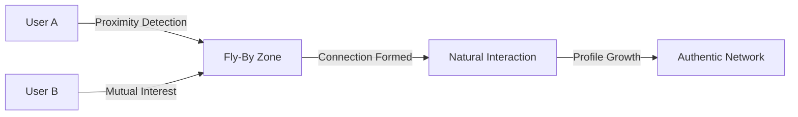
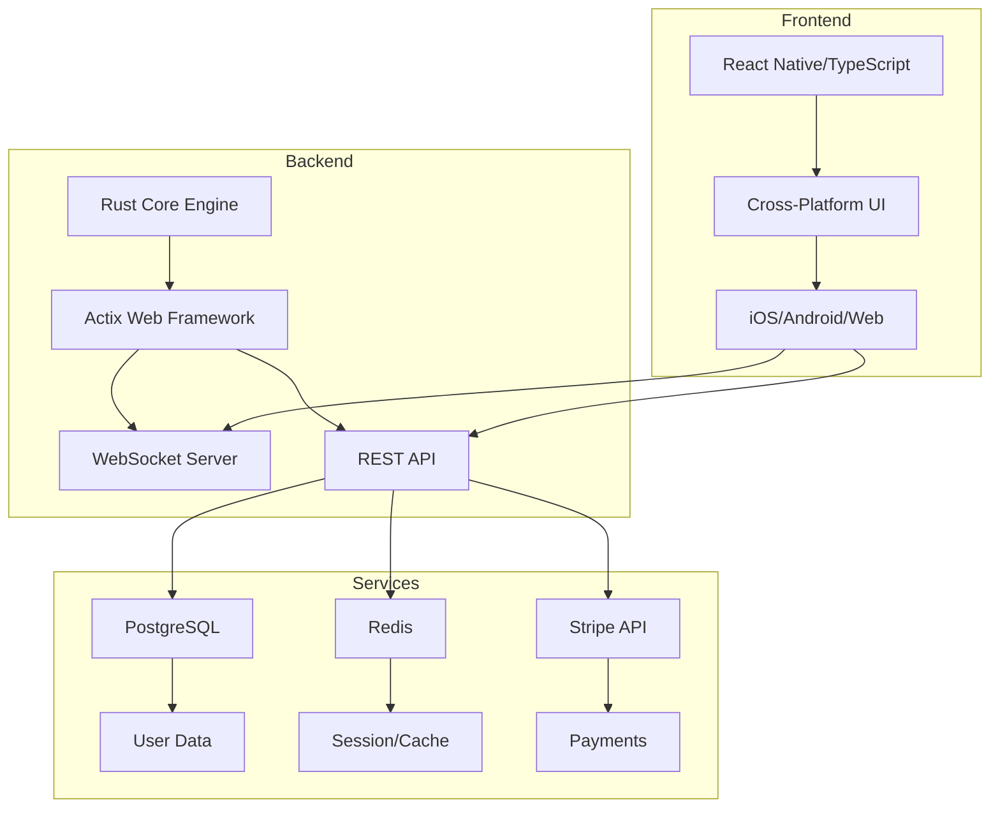

# iVibe.live 🌟

<div align="center">
  
  
  
  **Redefining Social Media Through Genuine Human Connection**
  
  [](https://www.rust-lang.org/)
  [](https://www.typescriptlang.org/)
  [](LICENSE)
  [](https://github.com/yourusername/iVibe.live-Pro)
  
  [Features](#features) • [Architecture](#architecture) • [Installation](#installation) • [Documentation](#documentation) • [Pricing](#pricing)

</div>

---

## 🚀 Overview

iVibe.live is a revolutionary social platform that transforms how people connect. Unlike traditional social media that breeds isolation behind screens, iVibe enables authentic connections through proximity-based "fly-by" interactions - turning everyday encounters into meaningful relationships.

### 🎯 Core Philosophy

> "The like button is the new handshake, the heart emoji the new hug. But what if we could bridge the digital divide and make real connections again?"

iVibe.live addresses the loneliness epidemic by:
- **Proximity-Based Growth**: Your profile grows through real-world interactions, not algorithmic manipulation
- **User-Controlled Privacy**: From complete anonymity to full publicity - you decide
- **Association Over Judgment**: Build connections naturally without the pressure of likes and follows
- **Authentic Engagement**: Real conversations replace performative posting

## ✨ Features

### 🔄 Fly-By Interactions
Revolutionary proximity-based connection system that detects and facilitates natural social encounters



### 🛡️ Privacy-First Design
- **Granular Control**: Adjust visibility settings per-interaction
- **Anonymous Mode**: Participate without revealing identity
- **Data Sovereignty**: Your data stays yours with local-first architecture

### 📈 Organic Growth System
- **Real-World Validation**: Profiles grow through physical presence
- **Quality Over Quantity**: Meaningful connections valued over follower counts
- **No Algorithmic Manipulation**: Transparent, user-driven discovery

### 🤝 Mental Health Focus
- **Anti-Bullying Architecture**: Designed to prevent harassment
- **Positive Reinforcement**: Encourages supportive interactions
- **Well-being Metrics**: Track and improve social health

## 🏗️ Architecture

### Technology Stack



### Performance Optimizations

- **Rust Backend**: Zero-cost abstractions for maximum performance
- **TypeScript Frontend**: Type safety with optimal bundle sizes
- **WebAssembly Bridge**: Critical path operations in WASM
- **Edge Computing**: Proximity calculations at the edge

## 📦 Installation

### Prerequisites

```bash
# System Requirements
- Rust 1.75+ (with cargo)
- Node.js 20+ (with npm/yarn)
- PostgreSQL 15+
- Redis 7+
```

### Quick Start

```bash
# Clone the repository
git clone https://github.com/yourusername/iVibe.live-Pro
cd iVibe.live-Pro

# Install dependencies
./scripts/setup.sh

# Configure environment
cp .env.example .env
# Edit .env with your configuration

# Start development servers
./scripts/dev.sh
```

### Platform-Specific Setup

<details>
<summary>🐧 Linux (Arch/KDE Plasma)</summary>

```bash
# Install system dependencies
sudo pacman -S rust nodejs postgresql redis

# For Wayland/KDE optimization
sudo pacman -S plasma-wayland-session

# Build and run
cargo build --release
npm run build:linux
```
</details>

<details>
<summary>🪟 Windows</summary>

```bash
# Using winget
winget install Rust.Rust
winget install OpenJS.NodeJS
winget install PostgreSQL.PostgreSQL
winget install Redis.Redis

# Build and run
cargo build --release
npm run build:windows
```
</details>

<details>
<summary>🍎 macOS</summary>

```bash
# Using Homebrew
brew install rust node postgresql redis

# Build and run
cargo build --release
npm run build:macos
```
</details>

## 💎 Pricing

| Plan | Price | Dashboard History | Email Reports | Programming Goals | Leaderboard | Integrations | Export | Mobile | Audio | Support |
|------|-------|------------------|---------------|-------------------|-------------|--------------|--------|--------|-------|---------|
| **Free** | $0/mo | 1 week | Weekly | 1 | Public | Basic | ❌ | ❌ | ❌ | Community |
| **Basic** | $5/mo | 2 weeks | Daily+Weekly | 3 | Private(5) | Basic | ❌ | ❌ | ❌ | Email |
| **Pro** | $10/mo | Unlimited | All options | Unlimited | Private(50) | All | ✅ | ✅ | ✅ | Priority Chat |
| **Team** | $17/mo | 365 days | All options | Unlimited | Private(100) | All | ✅ | ✅ | ✅ | Priority |
| **Business** | $20/mo | Unlimited | All options | Unlimited | Private(1000) | Custom | ✅ | ✅ | ✅ | Zoom+Phone |

## 🔧 Development

### Project Structure

```
iVibe.live-Pro/
├── backend/            # Rust backend services
│   ├── api/           # REST API handlers
│   ├── core/          # Business logic
│   ├── proximity/     # Fly-by detection engine
│   └── websocket/     # Real-time communications
├── frontend/          # TypeScript frontend
│   ├── mobile/        # React Native app
│   ├── web/           # Web application
│   └── shared/        # Shared components
├── infrastructure/    # Deployment configs
├── docs/             # Documentation
└── scripts/          # Build & deployment scripts
```

### Building from Source

```bash
# Backend (Rust)
cd backend
cargo build --release --features "proximity,stripe,websocket"

# Frontend (TypeScript)
cd frontend
npm install
npm run build:all

# Run tests
cargo test --all
npm test
```

### Performance Benchmarks

| Operation | Latency | Throughput |
|-----------|---------|------------|
| Fly-By Detection | < 10ms | 100k/sec |
| Connection Establishment | < 50ms | 10k/sec |
| Message Delivery | < 5ms | 1M/sec |
| Profile Sync | < 100ms | 5k/sec |

## 📚 Documentation

- [API Reference](docs/api/README.md)
- [Architecture Guide](docs/architecture/README.md)
- [Contributing Guidelines](CONTRIBUTING.md)
- [Security Policy](SECURITY.md)
- [Wiki](https://github.com/yourusername/iVibe.live-Pro/wiki)

## 🤝 Contributing

We welcome contributions that align with iVibe's mission of fostering genuine human connection. Please read our [Contributing Guidelines](CONTRIBUTING.md) and [Code of Conduct](CODE_OF_CONDUCT.md).

## 📄 License

iVibe.live is licensed under the MIT License - see the [LICENSE](LICENSE) file for details.

## 🙏 Acknowledgments

Built with ❤️ to combat social isolation and bring humanity back to social media.

---

<div align="center">
  
  **[Website](https://ivibe.live)** • **[Documentation](https://docs.ivibe.live)** • **[Community](https://community.ivibe.live)**
  
  Copyright © 2025 iVibe.live - Redefining Social Connection
  
</div>
